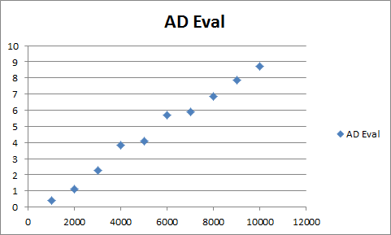
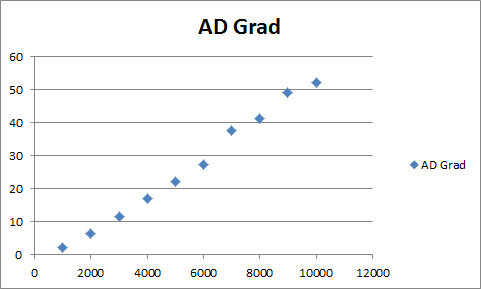
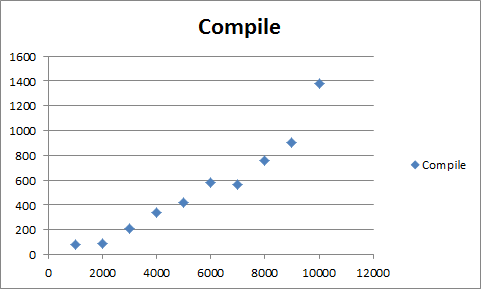
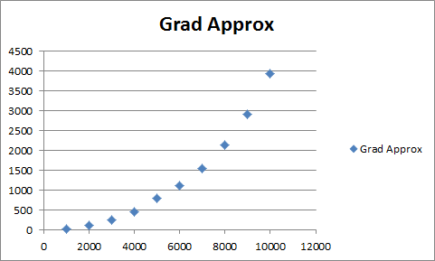
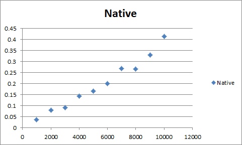

# The test
The benchmark program (link: [AutodiffBenchmark.zip](0.3 benchmark_AutodiffBenchmark.zip)) tests evaluation and differentiation of a chosen function and reports the timings. The function we tested is a sum of terms, where each term is a squared linear combination of 10 variables with random coefficients. Such function simulates the squared Laplacian norm of a mesh, where each vertex has on average 10 neighboring vertices. The benchmark program performs the following performance tests:
* Construction and compilation of the target function
* "Natively" evaluate the function. That is, without using AutoDiff. Just simple code to directly evaluate it.
* Approximate the gradient using the above native evaluation, by shifting values assigned to variables by a small epsilon.
* Use AutoDiff to evaluate the function.
* Use AutoDiff to differentiate the function.

Several tests are run for different function sizes. Given a number N, we construct a function of N variables that has N term. Each term is a linear combination of 10 variables, raised to the power of 2. We report the results for different input sizes.

# Expectations
* Native evaluation is supposed to be the fastest way to evaluate the function. It is used to compare how much slower is AutoDiff's evaluation compared to the native one.
* AutoDiff term construction, evaluation and differentiation are supposed to grow linearly with the input size.
* AutoDiff differentiation is supposed to be faster than gradient approximation. We claim that this is one of the main strengths of AutoDiff - you get both accuracy of exact gradient computation and speed of the linear-time computation.

# Results
The results are summarized in the following table. We measured the time for a single operation of each kind. For example, the _Native eval._ column displays the time for a single Native Evaluation operation. All timings are reported in milliseconds.
|| N || Construct || Native eval. || Approx. Grad. || AD Eval. || AD Diff ||
| 1000 | 82 | 0.036 | 24.23 | 0.39 | 2.128 |
| 2000 | 88 | 0.079 | 104.62 | 1.132 | 6.423|
| 3000 | 207 | 0.092 | 246.64 | 2.256 | 11.477 |
| 4000 | 342 | 0.144 | 457.78 | 3.85 | 17.075 |
| 5000 | 423 | 0.166 | 795.99 | 4.066 | 21.945 |
| 6000 | 581 | 0.2 | 1119.87 | 5.675 | 27.37 |
| 7000 | 568 | 0.268 | 1537.01 | 5.91 | 37.534 |
| 8000 | 757 | 0.265 | 2123.62 | 6.855 | 41.122 |
| 9000 | 902 | 0.329 | 2909.86 | 7.878 | 49.066 |
| 10000 | 1383 | 0.413 | 3926.53 | 8.742 | 52.101|

# Conclusions
* The time complexity expectations are met indeed. You can see the charts below
* On average, evaluation with AutoDiff is around 25 times slower than native evaluation. There is room for improvement!
* Differentiation using AutoDiff is orders of magnitude faster than approximating the gradient. 

# Remarks
Optimizing the Laplacian norm can be done very efficiently using a sparse linear solver and without any iterative methods requiring the user to compute gradients. So using AutoDiff is not really beneficial in this scenario. However, the Laplacian norm was chosen for the benchmark because it represents many functions that users may wish to optimize - a sum of terms such that each term contains a small amount of variables. 

# Charts
Here are some charts that show that the library meets the expectations.

