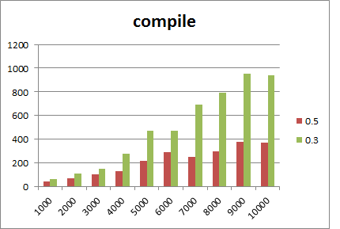
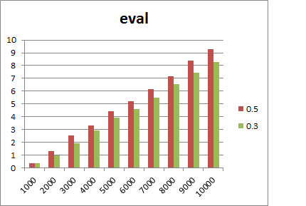

We used the same benchmark program as in the [0.3 benchmark](0.3-benchmark.md) page, but replaced the AutoDiff library with the newer version. Here are the results. We have a substantial improvement of compilation and differentiation time. However evaluation time is a bit slower.

In the following charts, the X axis is the number of terms and the Y axis is the time, in milliseconds.

The charts were constructed using the following excel file: [benchmark-0.5.xlsx](benchmark-0.5.xlsx).