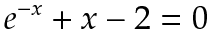

# The problem
Real world problems are often modeled by equations. The solution to those equations leads to the solution of our problems. However, problems in the real world are modeled by equations that are not solvable with pen and paper techniques (yes, they lied to you in high-school!). For example, the following equation cannot be solved analytically using pen and paper:



In this tutorial we will write a program that solves this kind of equations using the well-known Newton-Raphson method. For more information about this method read [here](http://en.wikipedia.org/wiki/Newton's_method).  We will call it the NR method in this tutorial.

# The solver
First, let's write a class that can solve a single-variable equation using the NR method. The NR method needs the left-hand-side function, an initial solution guess and a criterion for the iterations to stop. Here we will use a simple criterion - maximum number of iterations. Here is the code:
```c#
static class NewtonRaphson
{
    public static double Solve(Term leftHandSide, Variable x, double initGuess, int maxIterations = 10)
    {
        double guess = initGuess;
        var compiledFunc = leftHandSide.Compile(x);
        for (int i = 0; i < maxIterations; ++i) // perform maxIterations iterations
        {
            // perform differentiation
            var diffResult = compiledFunc.Differentiate(guess);
            
            // extract function value + derivative (the first element of the gradient)
            var dfx = diffResult.Item1[0];
            var fx = diffResult.Item2;
    
            // newton-raphson iteration: x <-- x - f(x) / f'(x)
            guess = guess - fx / dfx;
        }
        return guess;
    }
}
```

The first thing to note is that we used a compiled term representation inside the method. This allows us high-performance computation of the gradient and the value of our function inside the iterations loop. The second thing to note is that the AutoDiff library is not built for single-variable functions and always returns an array as a gradient. Therefore we need to extract the derivative from the array (the first, and the only element on the gradient array).

# Usage
Now we enjoy! We have built an NR solver for equations, and we can run it on various functions. We will demonstrate it on the equation given at the beginning of this tutorial. The first step is to plot the function of the left-hand-side and see where are the solutions. Here is the plot:


You can see that the equation has two solutions - one close to `x = -1` and another one close to `x = 2`. So we will write a small program to solve the equation (well, it's just an approximation for the solution, but a very accurate one).

```c#
static void Main(string[] args)
{

    var x = new Variable();
    var func = TermBuilder.Exp(-x) + x - 2;
    var root1 = NewtonRaphson.Solve(func, x, 2);
    var root2 = NewtonRaphson.Solve(func, x, -1);
    Console.WriteLine("The equation e^(-x) + x - 2 = 0 has two solutions:\nx = {0}\nx = {1}", root1, root2);
}
```
For the curious ones - here is the output:
```
The equation e^(-x) + x - 2 = 0 has two solutions:
x = 1.84140566043696
x = -1.14619322062058
```
You can use your favorite calculator to verify that both values indeed solve the equation.

# Summary
* Iterative solvers based on gradients (like Newton-Raphson) can easily be implemented using AutoDiff. The library takes care of the differentiation for the developer!
* Compiling the term is helpful for performance. Note that inside the iterations we use the same function, so compiling is beneficial.
